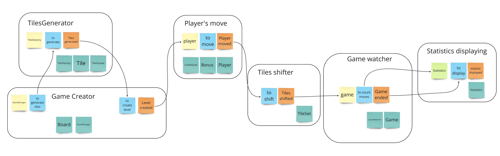

# Architecture

Формируем архитектуру, задаём принципы поведения системы: схемы создания объектов, обработки событий, увязки с выбранными фреймворками и технологиями, и тесты для типовых сценариев (проектирование).

### Высокоуровневая система

