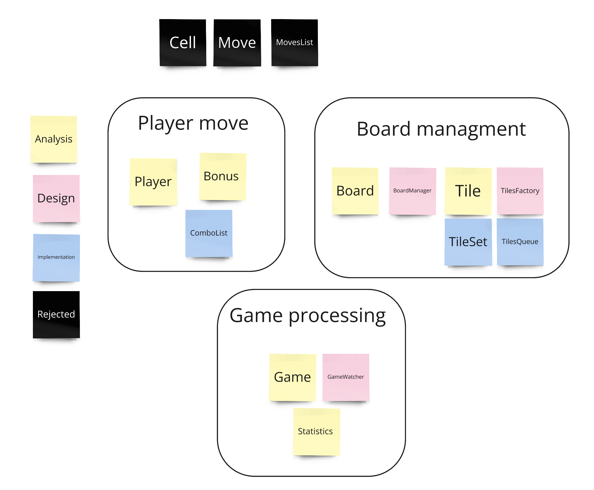
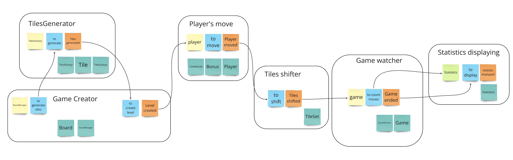

# Clustering

### Этап 1 - Определяем классы по кластерам (предварительно)

### Этап 2 - Примеряем Event Storming на систему, чтобы нарисовать модель взаимодействия

### Этап 3 - Финализируем кластера

Получились следующие кластеры из множества классов:
1. Tiles Generator (Состав классов: TilesFactory, Tile, TilesQueue)
2. Game Creator (Состав классов: Board, BoardManager)
3. Player's Move (Состав классов: Player, Bonus, ComboList)
4. Tiles Shifter (Состав классов: TileSet)
5. Game Watcher (Состав классов: Game, GameWatcher)
6. Statistics Displaying (Состав классов: Statistics)
