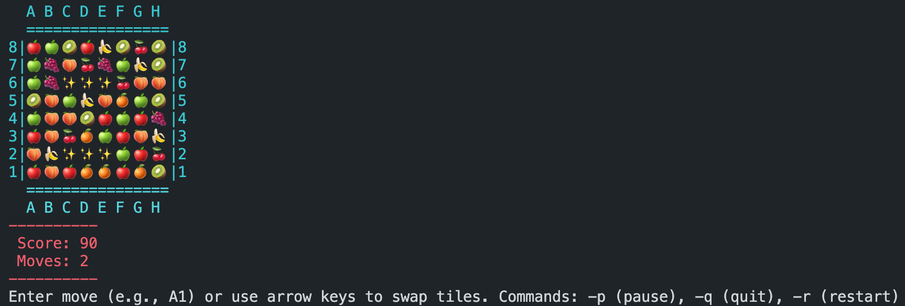

# Match-3 Console Game

### What is it

-> [About](Documents/About.md)

### How to run

1. Build the solution

~~~bash
dotnet build
~~~

2. Run the game!

~~~bash
dotnet run
~~~

Enjoy the Match-3 Console game!

### Requirements

.NET 8.0 => [download](https://dotnet.microsoft.com/ru-ru/download/dotnet/8.0)